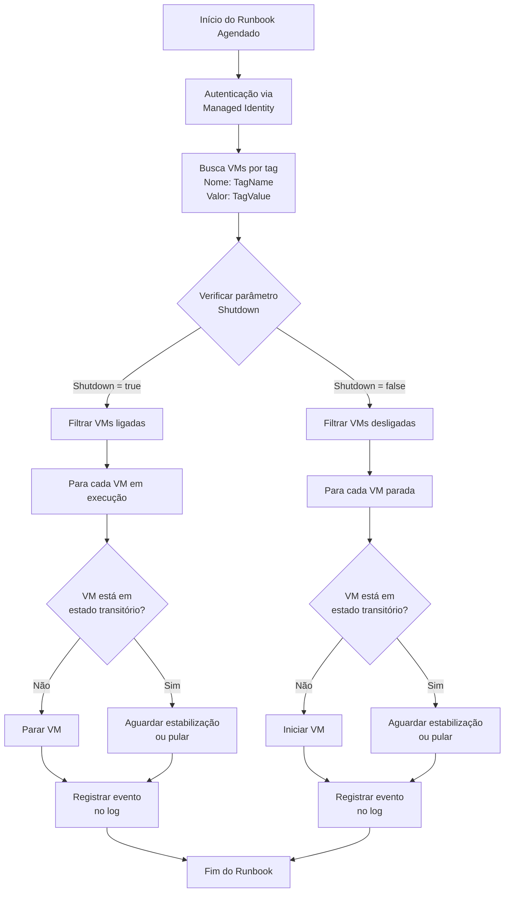

# ⚙️ Automação de Start/Stop para VMs Azure (Azure VM Auto Start/Stop)

[](https://www.linkedin.com/in/mathewsbuzetti)


## 📋 Metadados

| Metadado | Descrição |
|----------|-----------|
| **Título** | Automação de Start/Stop para VMs Azure (Azure VM Auto Start/Stop) |
| **Versão** | 1.0.0 |
| **Data** | 26/02/2025 |
| **Autor** | Mathews Buzetti |
| **Tags** | `azure-automation`, `powershell`, `start-stop-vms`, `cost-optimization`, `azure-cost-management`, `devops`, `cloud-automation`, `infrastructure-as-code` |
| **Status** | ✅ Aprovado para ambiente de produção |

## 💰 Economize até 70% em seus custos com Azure VMs

**Automatize totalmente o ciclo de início e parada das suas máquinas virtuais Azure com base em tags e agendamentos personalizados. Solução ideal para ambientes não-produtivos como desenvolvimento, testes, QA, e homologação.**

## 📌 Índice
- [✨ Benefícios-Chave](#-benefícios-chave)
- [🔍 Como Funciona](#-como-funciona)
- [⚙️ Pré-requisitos](#️-pré-requisitos)
- [🔧 Guia de Configuração Detalhado](#-guia-de-configuração-detalhado)
- [📝 Parâmetros do Script](#-parâmetros-do-script)
- [🔄 Versionamento](#-versionamento)

## ✨ Benefícios-Chave

| Benefício | Antes | Depois |
|-----------|-------|--------|
| **💰 Economia Substancial** | Máquinas virtuais executando 24/7 mesmo sem uso | VMs ligadas apenas quando necessárias com economia de até 70% |
| **⏱️ Gestão do Tempo** | Intervenção manual diária para ligar/desligar VMs | Automação completa baseada em agendamentos personalizados |
| **🔄 Flexibilidade** | Esquemas rígidos ou desligamentos manuais esquecidos | Agendamentos específicos para diferentes grupos de VMs por tag |
| **🔒 Segurança** | Credenciais expostas ou senhas armazenadas | Autenticação segura via Identidade Gerenciada sem senhas |
| **📊 Monitoramento** | Sem visibilidade das operações realizadas | Sistema detalhado de logs para auditoria e controle |

## 🔍 Como Funciona

O script PowerShell opera através de um processo otimizado e seguro com sistema avançado de detecção e registro de erros:



### Processo de Execução e Tratamento de Erros

1. **📡 Conexão**: 
   - Autentica-se ao Azure usando Managed Identity (sem credenciais expostas)
   - Logs detalhados em caso de falha de autenticação com mensagem específica sobre permissões necessárias

2. **🔍 Identificação**: 
   - Localiza todas as VMs com as tags especificadas nos parâmetros
   - Detecta quando nenhuma VM é encontrada e registra erro específico no log
   - Exemplo de log: `"Nenhuma VM encontrada com a TagName 'start' e TagValue '08:00'."`

3. **📊 Avaliação Inteligente**: 
   - Analisa o estado atual de cada VM para evitar operações redundantes
   - Detecta automaticamente estados de provisionamento com falha
   - Exemplo de log: `"VM WebServer01 já está iniciada."` (evitando operação desnecessária)
   - Exemplo de erro: `"A operação de provisionamento da VM WebServer02 falhou."`

4. **⚙️ Execução com Tratamento de Erros**: 
   - Realiza operações separadamente para cada VM com tratamento individual de erros
   - Se uma VM falhar, as demais continuam sendo processadas
   - Captura detalhes específicos de cada erro com o try/catch
   - Exemplo de erro: `"Falha ao iniciar a VM AppServer03: Insufficient quota to complete operation."`

5. **📝 Sistema de Logs de 4 Níveis**: 
   - **INFO**: Registra ações e estados normais
   - **SUCCESS**: Confirma operações bem-sucedidas 
   - **WARNING**: Alerta sobre situações que precisam de atenção
   - **ERROR**: Detalha falhas com informações para troubleshooting
   - Todos os logs incluem timestamp para auditoria precisa: `"2025-02-25 08:00:12 - SUCCESS: VM DBServer01 iniciada com sucesso."`

## ⚙️ Pré-requisitos

* Conta Azure ativa com permissões de **Owner** na subscription

> [!WARNING]  
> A conta usada para configurar a automação precisa ter permissões suficientes para atribuir a role "Virtual Machine Contributor" à Managed Identity da Automation Account.

## 🔧 Guia de Configuração Detalhado

### 1. Preparação da Automation Account

#### 1.1 Criar Automation Account

1. Acesse o **Portal Azure** ([portal.azure.com](https://portal.azure.com))
2. Clique em **Create a resource**
3. Pesquise por **Automation** e selecione **Automation Account**
4. Clique em **Create**
5. Preencha os campos necessários:
   - **Name:** Um nome exclusivo para sua conta (ex: AutomationVMs)
   - **Subscription:** Selecione sua assinatura Azure
   - **Resource group:** Selecione existente ou crie um novo
   - **Region:** Escolha a região mais próxima de você
6. Clique em **Review + create** e depois em **Create**

#### 1.2 Habilitar Managed Identity

1. Aguarde a criação da Automation Account e acesse-a
2. No menu lateral, em **Settings**, selecione **Identity**
3. Na aba **System Assigned**, defina o **Status** como **On**
   


4. Clique em **Save**
5. Na mesma tela acesse a opção **Azure role assignments**:
   


6. Na tela Azure role assignments preencha os dados

   - **Scope:** Subscription
   - **Subscription:** sua Assinatura
   - **Role:** Virtual Machine Contributor


> [!WARNING]  
> Não atribua mais permissões do que o necessário à Managed Identity. O princípio de "least privilege" deve ser aplicado para maior segurança.

### 2. Configuração do Script e Runbook

#### 2.1 Obter o Script Start-StopAzureVMsByTag.ps1

[](https://github.com/mathewsbuzetti/azure-vm-start-stop/blob/main/Start-StopAzureVMsByTag.ps1)

#### 2.2 Criar um Novo Runbook

1. Acesse sua **Automation Account** no Portal Azure
2. No menu lateral, em **Process Automation**, selecione **Runbooks**
3. Clique em **+ Create a runbook**
4. Preencha as informações:
   - **Name:** START_STOP_VMs
   - **Runbook type:** PowerShell
   - **Runtime version:** 5.1
   - **Description:** "Automação para iniciar e parar VMs com base em tags"
5. Clique em **Create**

#### 2.3 Importar o Script

1. No editor do runbook que acabou de abrir, apague qualquer código existente
2. Copie e cole o conteúdo completo do script **Script_Start_e_Stop_de_VMs.ps1**
3. Clique em **Save**
4. Depois em **Publish**


> [!WARNING]  
> Não altere os nomes dos parâmetros, pois os agendamentos farão referência a esses nomes específicos.

Depois de publicar vai voltar para tela inicial do runbook. Para configurar o Agendamento, siga os passos:

6. Acesse a opção **Resources** e depois **Schedules**:


7. Na tela de **Schedules**, clique em **Add a Schedule** e aparecerão duas opções conforme a imagem abaixo:


8. Vamos configurar primeiro o Schedule. Neste exemplo, configurei para ligar VMs às 08:00 da manhã:

Preencha as informações:
   - **Name:** StartVMs_Morning
   - **Description:** "Inicia as VMs nos dias úteis pela manhã"
   - **Starts:** Selecione a data e hora de início (recomendado: próximo dia útil às 8h)
   - **Time zone:** Selecione seu fuso horário local
   - **Recurrence:** Recurring
   - **Recur every:** 1 Day
   - **Set expiration:** No 
   - **Week days:** Selecione apenas os dias úteis (Monday to Friday)

> [!WARNING]  
> O Azure Automation usa UTC por padrão. Certifique-se de selecionar o fuso horário correto para que as VMs sejam iniciadas no horário local desejado.


9. Agora configure os **Parameters**:
     - TagName: start
     - TagValue: 08:00
     - Shutdown: false (para iniciar)
       


10. Depois clique em **OK** para criar o agendamento:


Para criar o agendamento de Stop, vamos seguir o mesmo processo, porém alterando o horário para 19:00:

11. Na tela de **Schedules**, clique em **Add a Schedule**:


12. Configure o Schedule para desligar as VMs às 19:00:

Preencha as informações:
   - **Name:** StopVMs_Evening
   - **Description:** "Para as VMs nos dias úteis à noite"
   - **Starts:** Selecione a data e hora de início (recomendado: próximo dia útil às 19h)
   - **Time zone:** Selecione seu fuso horário local (mesmo do agendamento anterior)
   - **Recurrence:** Recurring
   - **Recur every:** 1 Day
   - **Set expiration:** No
   - **Week days:** Selecione apenas os dias úteis (Monday to Friday)

> [!WARNING]  
> O Azure Automation usa UTC por padrão. Certifique-se de selecionar o fuso horário correto para que as VMs sejam paradas no horário local desejado.


13. Configure os **Parameters**:
     - TagName: stop
     - TagValue: 19:00
     - Shutdown: true (para desligar)
       


14. Depois clique em **OK** para criar o agendamento:


### Como Verificar os Logs de Execução

1. Acesse sua **Automation Account** no Portal Azure
2. No menu lateral, em **Process Automation**, selecione **Runbooks**
3. Clique no runbook **START_STOP_VMs**
4. Selecione a aba **Jobs** para ver todas as execuções
5. Clique no job específico que deseja analisar
6. Na aba **Output**, analise os logs detalhados da execução
7. Procure por mensagens de erro ou avisos que possam indicar o problema

> [!WARNING]  
> **Dica de diagnóstico:** O script utiliza diferentes níveis de log (INFO, SUCCESS, ERROR, WARNING) que podem ajudar a identificar o problema. Preste atenção especial às mensagens marcadas como ERROR ou WARNING.

### 4. Preparação das VMs

#### 4.1 Adicionar Tags às VMs

Para cada VM que você deseja incluir na automação:

1. No Portal Azure, acesse **Virtual Machines**
2. Clique na VM que deseja gerenciar
3. No menu lateral, selecione **Tags**
4. Adicione a tag com o mesmo nome e valor configurados nos agendamentos:
   - **Name:** Digite o nome da tag (ex: "start")
   - **Value:** Digite o valor da tag (ex: "07:00")
   - **Name:** Digite o nome da tag (ex: "stop")
   - **Value:** Digite o valor da tag (ex: "19:00")
5. Clique em **Save**


> [!WARNING]  
> As tags são case-sensitive. Certifique-se de que o nome e valor das tags nas VMs correspondam exatamente ao configurado nos agendamentos do Runbook.

## 📝 Parâmetros do Script

Os parâmetros abaixo devem ser configurados nos agendamentos do Runbook:

| Parâmetro | Descrição | Exemplo | Obrigatório |
|-----------|-----------|---------|-------------|
| `TagName` | Nome da tag para identificar as VMs | "start" | ✅ |
| `TagValue` | Valor da tag para filtrar as VMs | "08:00" | ✅ |
| `Shutdown` | Define a ação (true = desligar, false = iniciar) | true | ✅ |

**Exemplo de configuração para agendamento matutino:**
```powershell
TagName = "Environment"
TagValue = "Development" 
Shutdown = $false
```

**Exemplo de configuração para agendamento noturno:**
```powershell
TagName = "Environment"
TagValue = "Development" 
Shutdown = $true
```

## 🔄 Versionamento

- Versão: 1.0.0
- Última atualização: 26/02/2025
