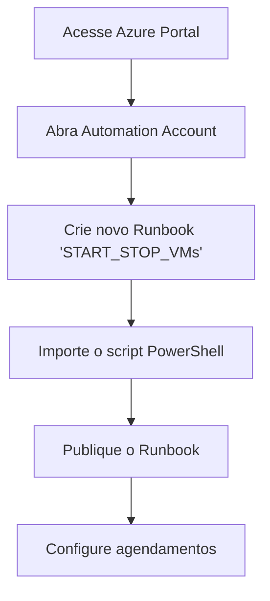
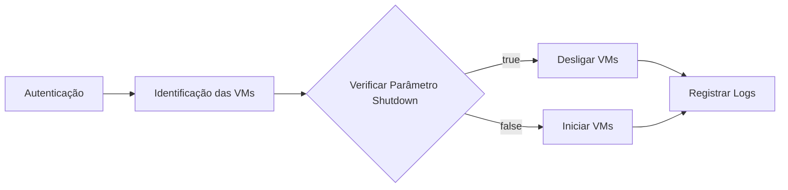

# ⚙️ Automação de Start/Stop para VMs Azure

**Otimize seus custos na Azure automatizando o início e parada de máquinas virtuais com base em tags e agendamentos personalizados.**

## 📌 Índice
- [Metadados](#-metadados)
- [Benefícios-Chave](#-benefícios-chave)
- [Visão Geral](#-visão-geral)
- [Pré-requisitos](#️-pré-requisitos)
- [Instalação e Configuração](#-instalação-e-configuração)
- [Parâmetros do Script](#-parâmetros-do-script)
- [Funcionamento](#️-funcionamento)
- [Resolução de Problemas](#-resolução-de-problemas)
- [Análise de Economia](#-análise-de-economia)
- [Licença](#-licença)

## 📋 Metadados

| Metadado | Descrição |
|----------|-----------|
| **Título** | Automação de Start/Stop para VMs Azure |
| **Versão** | 1.0.0 |
| **Data** | 18/02/2025 |
| **Autor** | Mathews Buzetti |
| **Tags** | `azure-automation`, `powershell`, `start-stop-vms`, `cost-optimization` |

## 🚀 Benefícios-Chave

- **💰 Economia Substancial**: Reduza custos em até 70% em ambientes não-produtivos
- **⏱️ Automação Completa**: Elimine intervenções manuais para iniciar e parar VMs
- **🔄 Flexibilidade**: Crie agendamentos específicos para diferentes grupos de VMs
- **🔒 Segurança Aprimorada**: Autenticação via Identidade Gerenciada sem credenciais expostas
- **📊 Rastreabilidade**: Sistema detalhado de logs para auditoria e monitoramento

## 📝 Visão Geral

Esta solução PowerShell automatiza o gerenciamento do ciclo de vida de máquinas virtuais no Azure com base em tags. Ideal para ambientes não-produtivos (desenvolvimento, testes, QA, homologação), permite programar o desligamento automático das VMs fora do horário comercial, gerando economia significativa de recursos sem comprometer a disponibilidade quando necessário.

## ⚙️ Pré-requisitos

- Subscrição Azure ativa
- Conta de Automação com privilégios de "Virtual Machine Contributor"
- Identidade Gerenciada configurada para a conta de Automação
- VMs Azure configuradas com as tags apropriadas

> [!IMPORTANT]  
> A conta de Automação **precisa ter** Identidade Gerenciada habilitada e receber as permissões necessárias para gerenciar as VMs. Esta configuração é essencial para o funcionamento do script.

## 🔧 Instalação e Configuração

### 1. Obtenha o Script

### 2. Configure o Runbook no Azure Automation

### 3. Configure os Agendamentos

#### Para Iniciar VMs (Manhã)
- **Agendamento**: Dias úteis às 9h
- **Parâmetros**:
  - `TagName`: Nome da tag (ex: "Ambiente")
  - `TagValue`: Valor da tag (ex: "Desenvolvimento")
  - `Shutdown`: false

#### Para Parar VMs (Noite)
- **Agendamento**: Dias úteis às 19h
- **Parâmetros**:
  - `TagName`: Nome da tag (ex: "Ambiente")
  - `TagValue`: Valor da tag (ex: "Desenvolvimento")
  - `Shutdown`: true

> [!WARNING]  
> Ao configurar agendamentos, verifique cuidadosamente o fuso horário. O Azure Automation utiliza UTC por padrão, o que pode exigir ajustes para corresponder ao seu horário local.

### 4. Preparação das VMs

Para cada VM que deseja incluir na automação:
1. Navegue até a VM no Azure Portal
2. Acesse a seção "Tags"
3. Adicione a tag com o mesmo nome e valor configurados no Runbook

> [!TIP]  
> Adote um padrão consistente para suas tags, como "AutoStartStop: True" ou "Environment: Dev". Lembre-se que tags são case-sensitive.

## 📝 Parâmetros do Script

| Parâmetro | Descrição | Obrigatório | Tipo | Exemplo |
|-----------|-----------|------------|------|---------|
| `TagName` | Nome da tag para identificar as VMs | Sim | String | "Ambiente" |
| `TagValue` | Valor da tag para filtrar as VMs | Sim | String | "Desenvolvimento" |
| `Shutdown` | Define a ação: true = desligar, false = iniciar | Sim | Boolean | true |

> [!CAUTION]  
> Não altere os nomes dos parâmetros no script. O Runbook espera exatamente esses nomes de parâmetros para funcionar corretamente.

## ⚙️ Funcionamento

O script executa as seguintes operações sequenciais:

1. **Autenticação**: Conexão segura ao Azure usando a Identidade Gerenciada
2. **Identificação**: Busca todas as VMs com a tag e valor especificados
3. **Verificação**: Analisa o estado atual de cada VM para evitar operações redundantes
4. **Operação**: Executa o comando de início ou parada conforme o parâmetro `Shutdown`
5. **Logging**: Registra detalhes da operação para auditoria

## 🔍 Resolução de Problemas

| Problema | Possível Causa | Solução |
|----------|----------------|---------|
| Erro "Identidade não configurada" | Identidade Gerenciada desativada | Ative a Identidade Gerenciada na conta de Automação |
| Permissão negada | Privilégios insuficientes | Atribua o papel "Virtual Machine Contributor" à Identidade Gerenciada |
| Nenhuma VM encontrada | Tags incorretas ou ausentes | Verifique a configuração de tags nas VMs e no script |
| VM permanece em estado transitório | Problemas na infraestrutura Azure | Verifique a integridade da VM no portal Azure e consulte os logs de diagnóstico |
| Agendamento não funciona | Configuração incorreta de fuso horário | Ajuste o fuso horário no agendamento para corresponder ao horário local |

## 📈 Análise de Economia

### Economia Mensal por Tipo de VM

| Tipo de VM | Custo Mensal (24/7) | Custo com Start/Stop (9h × dias úteis) | Economia Mensal | % Economia |
|------------|---------------------|----------------------------------------|----------------|-----------|
| B2s | $30.37 | $9.11 | $21.26 | 70% |
| D2s v3 | $91.10 | $27.33 | $63.77 | 70% |
| E2s v3 | $122.44 | $36.73 | $85.71 | 70% |

*Valores aproximados baseados em preços padrão, podendo variar conforme região e ofertas especiais.

## 📄 Licença

Este projeto está licenciado sob a [licença MIT](https://opensource.org/licenses/MIT).

---

**Desenvolvido por [Mathews Buzetti](https://www.linkedin.com/in/mathewsbuzetti)**

