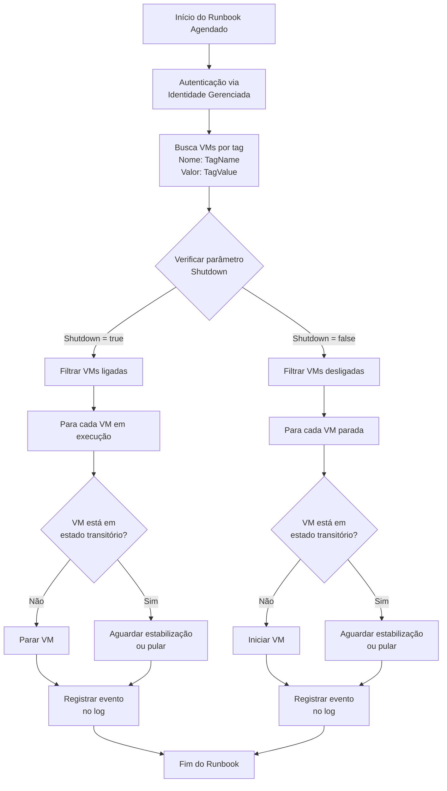

# ⚙️ Automação de Start/Stop para VMs Azure

[](https://www.linkedin.com/in/mathewsbuzetti)


## 📋 Metadados

| Metadado | Descrição |
|----------|-----------|
| **Título** | Automação de Start/Stop para VMs Azure |
| **Versão** | 1.0.0 |
| **Data** | 18/02/2025 |
| **Autor** | Mathews Buzetti |
| **Tags** | `azure-automation`, `powershell`, `start-stop-vms`, `cost-optimization` |
| **Status** | ✅ Aprovado para ambiente de produção |

## 💰 Economize até 70% em seus custos com Azure VMs

**Automatize totalmente o ciclo de início e parada das suas máquinas virtuais Azure com base em tags e agendamentos personalizados. Solução ideal para ambientes não-produtivos como desenvolvimento, testes, QA, e homologação.**

## 📌 Índice
- [✨ Benefícios-Chave](#-benefícios-chave)
- [🔍 Como Funciona](#-como-funciona)
- [⚙️ Pré-requisitos](#️-pré-requisitos)
- [🔧 Guia de Configuração Detalhado](#-guia-de-configuração-detalhado)
- [📝 Parâmetros do Script](#-parâmetros-do-script)
- [📄 Versionamento](#-Versionamento)

## ✨ Benefícios-Chave

| Benefício | Antes | Depois |
|-----------|-------|--------|
| **💰 Economia Substancial** | Máquinas virtuais executando 24/7 mesmo sem uso | VMs ligadas apenas quando necessárias com economia de até 70% |
| **⏱️ Gestão do Tempo** | Intervenção manual diária para ligar/desligar VMs | Automação completa baseada em agendamentos personalizados |
| **🔄 Flexibilidade** | Esquemas rígidos ou desligamentos manuais esquecidos | Agendamentos específicos para diferentes grupos de VMs por tag |
| **🔒 Segurança** | Credenciais expostas ou senhas armazenadas | Autenticação segura via Identidade Gerenciada sem senhas |
| **📊 Monitoramento** | Sem visibilidade das operações realizadas | Sistema detalhado de logs para auditoria e controle |

## 🔍 Como Funciona

O script PowerShell opera através de um processo otimizado e seguro:


```mermaid
flowchart TD
    A[Início do Runbook Agendado] --> B[Autenticação via\nIdentidade Gerenciada]
    B --> C[Busca VMs por tag\nNome: TagName\nValor: TagValue]
    C --> D{Verificar parâmetro\nShutdown}
    
    D -->|Shutdown = true| E[Filtrar VMs ligadas]
    D -->|Shutdown = false| F[Filtrar VMs desligadas]
    
    E --> G[Para cada VM em execução]
    F --> H[Para cada VM parada]
    
    G --> G1{VM está em\nestado transitório?}
    G1 -->|Sim| G2[Aguardar estabilização\nou pular]
    G1 -->|Não| G3[Parar VM]
    G3 --> G4[Registrar evento\nno log]
    G2 --> G4
    
    H --> H1{VM está em\nestado transitório?}
    H1 -->|Sim| H2[Aguardar estabilização\nou pular]
    H1 -->|Não| H3[Iniciar VM]
    H3 --> H4[Registrar evento\nno log]
    H2 --> H4
    
    G4 --> I[Fim do Runbook]
    H4 --> I
```

1. **📡 Conexão**: Autentica-se ao Azure usando Identidade Gerenciada (sem credenciais expostas)
2. **🔍 Identificação**: Localiza todas as VMs com as tags especificadas nos parâmetros
3. **📊 Avaliação**: Analisa o estado atual de cada VM para evitar operações redundantes
4. **⚙️ Execução**: Realiza a operação de iniciar ou parar conforme o parâmetro `Shutdown`
5. **📝 Registro**: Documenta detalhadamente cada ação para auditoria e monitoramento

## 🔧 Guia de Configuração Detalhado

### 1. Preparação da Conta de Automação

#### 1.1 Criar Conta de Automação

1. Acesse o **Portal Azure** ([portal.azure.com](https://portal.azure.com))
2. Clique em **Criar um recurso**
3. Pesquise por **Automation** e selecione **Conta de Automação**
4. Clique em **Criar**
5. Preencha os campos necessários:
   - **Nome:** Um nome exclusivo para sua conta (ex: AutomacaoVMs)
   - **Assinatura:** Selecione sua assinatura Azure
   - **Grupo de recursos:** Selecione existente ou crie um novo
   - **Região:** Escolha a região mais próxima de você
6. Clique em **Revisar + criar** e depois em **Criar**

#### 1.2 Habilitar Identidade Gerenciada

1. Aguarde a criação da conta de automação e acesse-a
2. No menu lateral, em **Configurações**, selecione **Identidade**
3. Na aba **System Assigned**, defina o **Status** como **On**
   


4. Clique em **Salvar**
5. Na mesma tela acessar opção Permissions:
   


6. Na tela Azure role assignments preencha os dados

   - **Scope:** Subscription
   - **Subscription:** sua Assinatura
   - **Role:** Virtual Machine Contributor


### 2. Configuração do Script e Runbook

#### 2.1 Obter o Script PowerShell

[](https://github.com/mathewsbuzetti/azure-infrastructure-template/blob/main/Scripts/Script_Start_e_Stop_de_VMs.ps1)

#### 2.2 Criar um Novo Runbook

1. Acesse sua **Conta de Automação** no Portal Azure
2. No menu lateral, em **Recursos de automação**, selecione **Runbooks**
3. Clique em **+ Criar um runbook**
4. Preencha as informações:
   - **Nome:** START_STOP_VMs
   - **Tipo de runbook:** PowerShell
   - **Versão do Runtime:** 5.1
   - **Descrição:** "Automação para iniciar e parar VMs com base em tags"
5. Clique em **Criar**

#### 2.3 Importar o Script

1. No editor do runbook que acabou de abrir, apague qualquer código existente
2. Copie e cole o conteúdo completo do script **Script_Start_e_Stop_de_VMs.ps1**
4. Clique em **Salve**
5. Depois em **Publish**


> [!WARNING]\
> Não altere os nomes dos parâmetros, pois os agendamentos farão referência a esses nomes específicos.

Depois de publicar vai voltar para tela inicial do runbook voltando você vai configurar o Agendamento segue o passo:

6. Acessar opção Resources e depois Schedules:


7. Na tela de Schedules você vai apertar em Add a Schedule e vai aparecer duas opçãoc conforme a imagem abaixo:


8. Vamos configurar primeiro o Schedule nesse exemplo meu coloquei para ligar vm as 08:00 da manhã:

Preencha as informações:
   - **Nome:** StartVMs_Morning
   - **Descrição:** "Inicia as VMs nos dias úteis pela manhã"
   - **Iniciar:** Selecione a data e hora de início (recomendado: próximo dia útil às 8h)
   - **Fuso horário:** Selecione seu fuso horário local
   - **Recorrência:** Recorrente
   - **Repetir a cada:** 1 Dia
   - **Definir expiração:** Não 
   - **Dias da semana:** Selecione apenas os dias úteis (Segunda a Sexta)

> **Atenção ao Fuso Horário:** O Azure Automation usa UTC por padrão. Certifique-se de selecionar o fuso horário correto para que as VMs sejam iniciadas no horário local desejado.


9. Vamos configurar agora os Parameters
     - TagName: start
     - TagValue: 08:00
     - Shutdown: false (para iniciar)
       


10. Depois aperta em OK para criar o agendamento:


Para criar o agendamento de Stop vamos seguir o mesmo passo mais trocando o horario para as 19:00

7. Na tela de Schedules você vai apertar em Add a Schedule e vai aparecer duas opçãoc conforme a imagem abaixo:


8. Vamos configurar primeiro o Schedule nesse exemplo meu coloquei para ligar vm as 19:00 da noite:

Preencha as informações:
   - **Nome:** StopVMs_Evening
   - **Descrição:** "Para as VMs nos dias úteis à noite"
   - **Iniciar:** Selecione a data e hora de início (recomendado: próximo dia útil às 19h)
   - **Fuso horário:** Selecione seu fuso horário local (mesmo do agendamento anterior)
   - **Recorrência:** Recorrente
   - **Repetir a cada:** 1 Dia
   - **Definir expiração:** Não
   - **Dias da semana:** Selecione apenas os dias úteis (Segunda a Sexta)

> **Atenção ao Fuso Horário:** O Azure Automation usa UTC por padrão. Certifique-se de selecionar o fuso horário correto para que as VMs sejam iniciadas no horário local desejado.


9. Vamos configurar agora os Parameters
     - TagName: stop
     - TagValue: 19:00
     - Shutdown: true (para desligar)
       


10. Depois aperta em OK para criar o agendamento:


### 4. Preparação das VMs

#### 4.1 Adicionar Tags às VMs

Para cada VM que você deseja incluir na automação:

1. No Portal Azure, acesse **Máquinas Virtuais**
2. Clique na VM que deseja gerenciar
3. No menu lateral, selecione **Tags**
4. Adicione a tag com o mesmo nome e valor configurados nos agendamentos:
   - **Nome:** Digite o nome da tag (ex: "start")
   - **Valor:** Digite o valor da tag (ex: "07:00")
   - **Nome:** Digite o nome da tag (ex: "stop")
   - **Valor:** Digite o valor da tag (ex: "19:00")
5. Clique em **Salvar**


### Como Verificar os Logs de Execução

1. Acesse sua **Conta de Automação** no Portal Azure
2. No menu lateral, em **Recursos de automação**, selecione **Runbooks**
3. Clique no runbook **START_STOP_VMs**
4. Selecione a aba **Jobs** para ver todas as execuções
5. Clique no job específico que deseja analisar
6. Na aba **Saída**, analise os logs detalhados da execução
7. Procure por mensagens de erro ou avisos que possam indicar o problema

> [!WARNING]\
> **Dica de diagnóstico:** O script utiliza diferentes níveis de log (INFO, SUCCESS, ERROR, WARNING) que podem ajudar a identificar o problema. Preste atenção especial às mensagens marcadas como ERROR ou WARNING.

## 📝 Parâmetros do Script

Os parâmetros abaixo devem ser configurados nos agendamentos do Runbook:

| Parâmetro | Descrição | Exemplo | Obrigatório |
|-----------|-----------|---------|-------------|
| `TagName` | Nome da tag para identificar as VMs | "start" | ✅ |
| `TagValue` | Valor da tag para filtrar as VMs | "08:00" | ✅ |
| `Shutdown` | Define a ação (true = desligar, false = iniciar) | true | ✅ |

**Exemplo de configuração para agendamento matutino:**
```powershell
TagName = "Ambiente"
TagValue = "Desenvolvimento" 
Shutdown = $false
```

**Exemplo de configuração para agendamento noturno:**
```powershell
TagName = "Ambiente"
TagValue = "Desenvolvimento" 
Shutdown = $true
```

## 🔄 Versionamento

- Versão: 1.0.0
- Última atualização: 25/02/2025
